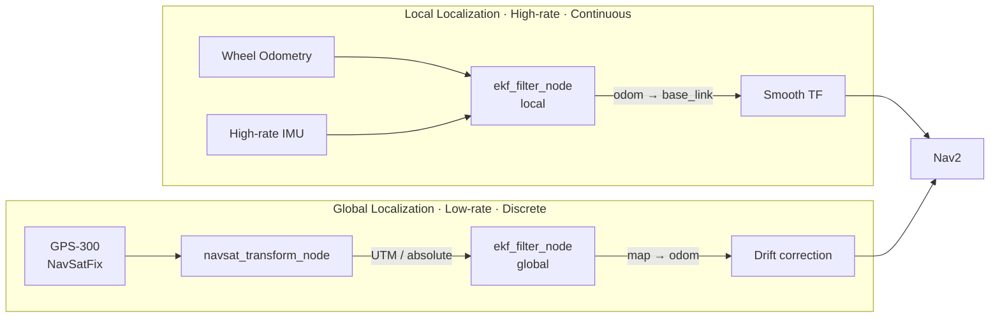

# WitMotion GPS-300 (TTL) ကို ROS 2 Nav2 ဖြင့် အသုံးပြုခြင်း — သုံးသပ်ချက်

> WitMotion GPS-300 (TTL) ကို ROS 2 **Nav2** stack မှာ ထည့်သုံးဖို့ စဉ်းစားတာ အိုင်ဒီယာ
> ကောင်းတစ်ခု ဖြစ်နိုင်ပါတယ်။ ဒါပေမဲ့ သူက **ဘာကို ဖြေရှင်းပေးနိုင်လဲ**၊ **ဘယ်နေရာမှာ
> ကန့်သတ်ချက် ရှိလဲ** ဆိုတာ ချိန်ဆဖို့ လိုပါတယ်။ မြေပြင်မှာ တကယ်ပြေးမယ့်
> AMR/AGV (Outdoor / Semi-outdoor) နဲ့ ခြေကျင်းစက်ရုပ်တွေအတွက် အားသာ/အားနည်းချက်နဲ့
> architecture သဘောထားကို အောက်မှာ သုံးသပ်ထားပါတယ်။

---

## ၁. ကောင်းမွန်တဲ့ အချက်များ (Pros) ✅

### 🌍 Global Position Reference
Nav2 ရဲ့ `robot_localization` package မှာ local EKF (Odom + IMU) အပြင်
**ဒုတိယ global EKF instance** တစ်ခု ထပ် run ပြီး `navsat_transform_node` ကတစ်ဆင့်
GPS data ကို fusion လုပ်လို့ ရပါတယ်။ ကွင်းပြင်ကျယ် (ဥပမာ — မီတာ ၁၀၀ ကျော် long-range)
သွားတဲ့အခါ Odom ရဲ့ **drift** ကို GPS က ပြန်ထိန်း (correct) ပေးနိုင်ပါတယ်။

### 🔌 TTL Interface
- Jetson / Rockchip board တွေရဲ့ **UART (Serial) pin** နဲ့ တိုက်ရိုက် ချိတ်လို့ရ
- **USB-to-TTL** converter ခံပြီး Ubuntu PC မှာ `/dev/ttyUSB0` အဖြစ် အလွယ်တကူ ဖတ်လို့ရ

### 🧩 Driver Compatibility
WitMotion က **NMEA-0183 standard** (သို့) ကိုယ်ပိုင် protocol သုံးတတ်ပါတယ်။
ROS 2 Humble / Scarthgap မှာ `nmea_navsat_driver` သုံးပြီး `sensor_msgs/msg/NavSatFix`
standard topic အဖြစ် ပြောင်းရတာ လွယ်ပါတယ်။

---

## ၂. စိန်ခေါ်မှုနှင့် အားနည်းချက်များ (Cons & Trade-offs) ⚠️

| အချက် | ပြဿနာ |
|-------|--------|
| 🎯 **Accuracy** | Single-frequency (L1) receiver မို့ error range **2.5m – 5m**။ RTK မပါလို့ centimeter-level တိကျမှု လိုတဲ့ စက်ရုံတွင်း AMR တွေအတွက် **မရ** |
| 🏠 **Indoor** | အမိုးအောက်မှာ line-of-sight ပျောက် → **multi-path error**။ Indoor/Outdoor ကူးတဲ့နေရာတွေမှာ localization ကမောက်ကမ ဖြစ်စေနိုင် |
| ⏱️ **Update Rate** | default **1Hz – 10Hz** သာ။ Nav2 control loop (DWA / TEB / RPP) တွေက **20Hz+** လိုလို့ GPS တစ်ခုတည်း အားကိုးလို့ မရ |

---

## ၃. Nav2 နဲ့ တွဲသုံးရင် အဆင်ပြေဆုံး Architecture 🏗️

GPS-300 ကို **Primary Sensor အဖြစ် မထား**ဘဲ **Secondary Correction Sensor**
အဖြစ်သာ ချဉ်းကပ်သင့်ပါတယ်။

| အဆင့် | လုပ်ဆောင်ချက် |
|------|----------------|
| **Local (Continuous)** | Wheel Odometry + high-rate IMU → `ekf_filter_node (local)` → `odom → base_link`။ Smooth + frequency မြင့်ရမယ် |
| **Global (Discrete)** | NavSatFix → `navsat_transform_node` (UTM ပြောင်း) → `ekf_filter_node (global)` → `map → odom` |
| **GPS Fusion Tuning** | `robot_localization` မှာ differential mode `true` ပေး (သို့) covariance ကို လက်တွေ့ ညှိ — တန်ဖိုးနိမ့် GPS တွေက **covariance spike** ဖြစ်တတ်လို့ |

---

## 🏁 နိဂုံးချုပ်

| အသုံးပြုမှု | အကြံပြုချက် |
|-----------|-------------|
| 🏭 **Indoor AMR** (စက်ရုံတွင်း/အဆောက်အဦးတွင်း) | ❌ **အသုံးမပြုသင့်**။ အစား **LiDAR SLAM** (AMCL / Nav2 Smac Planner) (သို့) **Visual / QR-based VIO** က ပိုတိကျ |
| 🌾 **Outdoor** (ကွင်းပြင်/စိုက်ပျိုးရေး/Delivery) | ✅ တွဲသုံး **အဆင်ပြေ**။ ဒါပေမဲ့ နေရာကျဉ်းထဲ တိတိကျကျ မောင်းရရင် **RTK-GPS** (ဥပမာ — u-blox **ZED-F9P**) သို့ ပြောင်းမှ Nav2 ရဲ့ goal tolerance (~0.1m) ကို ဆွဲနိုင်မယ် |

> **အနှစ်ချုပ်:** GPS-300 = *outdoor drift correction* အတွက် ကောင်း၊
> *precision indoor navigation* အတွက် မသင့်။ centimeter-level လိုရင် RTK module သုံးပါ။