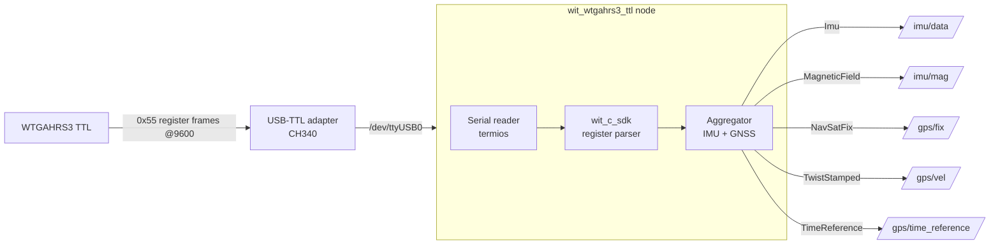

# rom_wit_wtgahrs3_ttl

WitMotion **WTGAHRS3 (TTL)** — **10-axis IMU + GNSS** integrated sensor အတွက် ROS 2 (C++) driver package။
Sensor ထုတ်ပေးတဲ့ WitMotion **register protocol** (0x55 frame) data ကို serial (TTL/UART)
ကနေ ဖတ်ပြီး ROS 2 standard message အဖြစ် publish လုပ်ပေးဖို့ ရည်ရွယ်ပါတယ်။

> Reference: <https://www.wit-motion.com/GNSSPositioning/25.html>

---

## 1. WTGAHRS3 ဆိုတာ ဘာလဲ

WTGAHRS3 က WitMotion ရဲ့ **IMU + GNSS ပေါင်းစပ်** sensor တစ်ခုဖြစ်ပါတယ်။
IMU sensor (WT901 မျိုး) တွေနဲ့ GPS module ကို တစ်ခုတည်းမှာ ပေါင်းစည်းထားတာမို့
**attitude (AHRS)** နဲ့ **positioning (GNSS)** ကို တစ်ပြိုင်နက် ရနိုင်ပါတယ်။

### ပါဝင်တဲ့ sensor များ (10-axis)

| အုပ်စု | Sensor | ထုတ်ပေးတဲ့ data |
|--------|--------|------------------|
| Inertial | 3-axis accelerometer | acceleration (ax, ay, az) |
| Inertial | 3-axis gyroscope | angular velocity (wx, wy, wz) |
| Magnetic | 3-axis magnetometer | magnetic field (mx, my, mz) |
| Barometric | barometer | air pressure + altitude |
| Attitude | sensor fusion (AHRS) | angle (roll, pitch, yaw) + quaternion |
| GNSS | GPS / BeiDou / GLONASS | latitude, longitude, GPS altitude, ground speed, heading |

### အဓိက ကွာခြားချက် — WTGPS-300 နဲ့ မတူ

- **WTGPS-300** → pure **NMEA-0183** (GPS module သက်သက်၊ `wit_sdk` မလို)။
- **WTGAHRS3** → WitMotion **register protocol** (`0x55` frame header) သုံးတယ်။
  IMU register data မို့ **`wit_sdk` (wit_c_sdk) protocol parser လိုအပ်**ပါတယ်။
  (`rom_wit_wt901` package ထဲက `wit_c_sdk.c` / `REG.h` ကို reference လုပ်နိုင်)

### Communication

| အချက် | တန်ဖိုး |
|-------|---------|
| Interface | TTL / UART serial (USB-TTL adapter — CH340 မျိုး) |
| Default baud | `9600` (configurable — 230400 အထိ) |
| Frame header | `0x55` (WitMotion register protocol) |
| Output rate | IMU အတွက် 200Hz အထိ၊ GNSS အတွက် module dependent |
| Power | 3.3V – 5V |

---

## 2. ပေးနိုင်တဲ့ Data → ROS 2 message mapping (စီစဉ်ထားချက်)

| အမျိုးအစား | Data | ROS 2 message (အကြံပြု) | Topic (default) |
|-----------|------|--------------------------|-----------------|
| IMU | acceleration + angular velocity + orientation | `sensor_msgs/Imu` | `imu/data` |
| Magnetic | magnetic field | `sensor_msgs/MagneticField` | `imu/mag` |
| Attitude | roll / pitch / yaw | `geometry_msgs/Vector3Stamped` | `imu/rpy` |
| Barometer | air pressure | `sensor_msgs/FluidPressure` | `imu/pressure` |
| Position | latitude / longitude / altitude | `sensor_msgs/NavSatFix` | `gps/fix` |
| Velocity | ground speed + heading | `geometry_msgs/TwistStamped` | `gps/vel` |
| Time | GNSS UTC time | `sensor_msgs/TimeReference` | `gps/time_reference` |

---

## 3. စီစဉ်ထားတဲ့ Architecture



---

## 4. Package အခြေအနေ

> ⚠️ ဒီ package က **ဖွဲ့စည်းပုံ scaffold** အဆင့်သာ ဖြစ်ပါသေးတယ်။
> `src/` ထဲ node source မထည့်ရသေးပါ။ အောက်က dependency တွေ ready ဖြစ်ပြီးသား —

`package.xml` dependencies:

- `rclcpp`
- `std_msgs`
- `sensor_msgs`
- `geometry_msgs`

### နောက် လုပ်ရန် (TODO)

1. `wit_c_sdk` register parser ကို `rom_wit_wt901` ကနေ ယူ/copy လုပ်ရန်။
2. `src/wit_wtgahrs3_ttl.cpp` — serial read + register decode + ROS publish node ရေးရန်။
3. `CMakeLists.txt` ထဲ `add_executable` + `ament_target_dependencies` + `install` ထည့်ရန်။
4. `config/` (yaml params: port, baudrate, frame_id, topic names) + `launch/` ထည့်ရန်။

---

## 5. Build & Run (node ပြီးတဲ့အခါ)

```bash
cd ~/Desktop/Git/rom_witmotion_ros2_pkgs

colcon build --packages-select rom_wit_wtgahrs3_ttl
source install/setup.bash

# serial device permission
sudo chmod 666 /dev/ttyUSB0

# run (executable ရေးပြီးမှ)
ros2 run rom_wit_wtgahrs3_ttl wit_wtgahrs3_ttl

# data စစ်ရန်
ros2 topic echo /imu/data
ros2 topic echo /gps/fix
```

---

## 6. References

- WitMotion WTGAHRS3 product page — <https://www.wit-motion.com/GNSSPositioning/25.html>
- WitMotion register protocol SDK — `rom_wit_wt901/src/wit_c_sdk.c`, `REG.h`
- Sibling package (pure NMEA GPS) — `rom_wit_wtgps_300`
