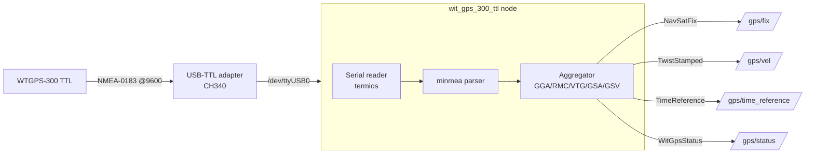
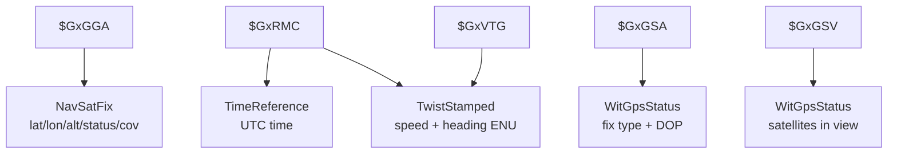

# rom_wit_wtgps_300

WitMotion **WTGPS-300 (TTL)** GNSS module အတွက် ROS 2 (C++) driver package။
Module ထုတ်ပေးတဲ့ standard **NMEA-0183** data ကို serial (TTL/UART) ကနေ ဖတ်ပြီး
ROS 2 standard message အဖြစ် publish လုပ်ပေးပါတယ်။

---

## 1. WTGPS-300 TTL ဆိုတာ ဘာလဲ

- GPS + BeiDou positioning module (IMU/acceleration **မပါ**)။
- Output က **standard NMEA-0183** ASCII sentences (`$GxGGA`, `$GxRMC`, `$GxVTG`, `$GxGSA`, `$GxGSV`)။
- Serial TTL၊ default **9600 baud**။
- **`wit_sdk` မလို** — wit_sdk က သူတို့ IMU sensor (WT901 စသည်) register protocol အတွက်သာ။
  GPS module က NMEA standard မို့ TTL ကနေ တိုက်ရိုက် ဖတ်ရုံပါ။

### ပေးနိုင်တဲ့ Data

| အမျိုးအစား | Data | NMEA source |
|-----------|------|-------------|
| Position | latitude, longitude, altitude | GGA / RMC |
| Motion | speed, heading/course | RMC / VTG |
| Time | UTC date & time | RMC / ZDA |
| Fix | fix quality, fix mode (2D/3D), satellites used | GGA / GSA |
| Satellites | visible count, PRN, elevation, azimuth, SNR | GSV |
| Accuracy | PDOP, HDOP, VDOP | GSA |

---

## 2. ROS 2 node ရေးနိုင်တဲ့ နည်းလမ်းများ

| နည်းလမ်း | ဖော်ပြချက် | wit_sdk |
|---------|-----------|---------|
| A. `nmea_navsat_driver` (ready-made) | install + config ရုံ၊ Python၊ satellite/DOP မရ | မလို |
| B. ကိုယ်ပိုင် C++ node + manual parser | full control | မလို |
| **C. ကိုယ်ပိုင် C++ node + NMEA lib (minmea)** ⭐ | full control + parsing bug နည်း | မလို |

> ဒီ package က **နည်းလမ်း C** ကို သုံးထားပါတယ် — `minmea` (single-file, public-domain
> NMEA parser) ကို vendor လုပ်ပြီး serial read + ROS publish ကို C++ နဲ့ ရေးထားတယ်။

---

## 3. Architecture



### NMEA sentence → ROS message mapping



---

## 4. Published Topics

| Topic (default) | Message type | Data |
|-----------------|-------------|------|
| `gps/fix` | `sensor_msgs/NavSatFix` | lat / lon / alt / status / covariance (HDOP) |
| `gps/vel` | `geometry_msgs/TwistStamped` | speed + heading (ENU: x=east, y=north) |
| `gps/time_reference` | `sensor_msgs/TimeReference` | GNSS UTC time |
| `gps/status` | `rom_wit_wtgps_300/WitGpsStatus` | fix type + PDOP/HDOP/VDOP + satellites |

### NavSatFix ပါဝင်တာ
`header`, `status` (status + service: GPS|COMPASS), `latitude`, `longitude`,
`altitude`, `position_covariance` (HDOP ကနေ ခန့်မှန်း), `position_covariance_type`။

---

## 5. Configuration — `config/witgps.yaml`

| Parameter | Default | ဖော်ပြချက် |
|-----------|---------|-----------|
| `port` | `/dev/ttyUSB0` | TTL serial device |
| `baudrate` | `9600` | 4800–230400 |
| `frame_id` | `gps` | message frame_id |
| `fix_topic` / `vel_topic` / `time_ref_topic` / `status_topic` | — | output topic names |
| `time_ref_source` | `gps` | TimeReference source string |
| `strict_checksum` | `true` | checksum မမှန်တဲ့ sentence ဖယ် |
| `use_vtg_velocity` | `true` | velocity: VTG (true) vs RMC (false) |
| `horizontal_accuracy` | `2.5` | metres၊ HDOP→covariance sigma |
| `service_gps` / `service_beidou` | `true` | NavSatFix service mask |

---

## 6. Build & Run

```bash
cd ~/Desktop/Git/rom_witmotion_ros2_pkgs

# normal build
colcon build --packages-select rom_wit_wtgps_300

# debug build — ရလာတဲ့ NMEA field အကုန်ကို RCLCPP_INFO ထုတ်မယ် (#ifdef ROM_DEBUG)
colcon build --packages-select rom_wit_wtgps_300 --cmake-args -DROM_DEBUG=ON

source install/setup.bash
ros2 launch rom_wit_wtgps_300 witgps.launch.py

# data စစ်ရန်
ros2 topic echo /gps/fix
ros2 topic echo /gps/status
```

---

## 7. Troubleshooting — `/dev/ttyUSB*` မပေါ်ခြင်း

WTGPS-300 က TTL module ဖြစ်လို့ **USB-to-TTL adapter** (CH340 / CP2102 / FTDI / PL2303) လိုပါတယ်။

### CH340 adapter ကို `brltty` က သိမ်းထားခြင်း (Ubuntu 22.04+ classic issue)

CH340 (`1a86:7523`) ကို braille service `brltty` က ဝင်သိမ်းလို့ `ttyUSB0` ပြုတ်တတ်ပါတယ်။
စစ်ရန်:

```bash
sudo dmesg | grep -iE 'ch34|brltty|ttyUSB'
# "interface 0 claimed by ch341 while 'brltty' sets config" ဆိုရင် ဒါပဲ
```

**ဖြေရှင်းနည်း A (recommended):**
```bash
sudo apt remove -y brltty
# ပြီးရင် adapter ဖြုတ်/ပြန်ထိုး
```

**ဖြေရှင်းနည်း B (reversible):**
```bash
sudo systemctl stop brltty-udev.service
sudo systemctl mask brltty-udev.service
sudo sed -i 's/^/#/' /usr/lib/udev/rules.d/85-brltty.rules
sudo udevadm control --reload-rules
# ပြီးရင် adapter ပြန်ထိုး
```

### permission ပြဿနာ
```bash
sudo usermod -aG dialout $USER   # ပြီးရင် logout/login
```

---

## 8. Package Structure

```
rom_wit_wtgps_300/
├── src/wit_gps_300_ttl.cpp        # driver node
├── third_party/minmea/            # vendored NMEA parser (minmea.c/.h)
├── msg/
│   ├── SatelliteInfo.msg          # prn, elevation, azimuth, snr
│   └── WitGpsStatus.msg           # fix type + DOP + satellites[]
├── config/witgps.yaml             # parameters
├── launch/witgps.launch.py        # launch file
├── CMakeLists.txt
└── package.xml
```

---

## License & Credits

- NMEA parsing: [minmea](https://github.com/kosma/minmea) by Kosma Moczek (WTFPL).
